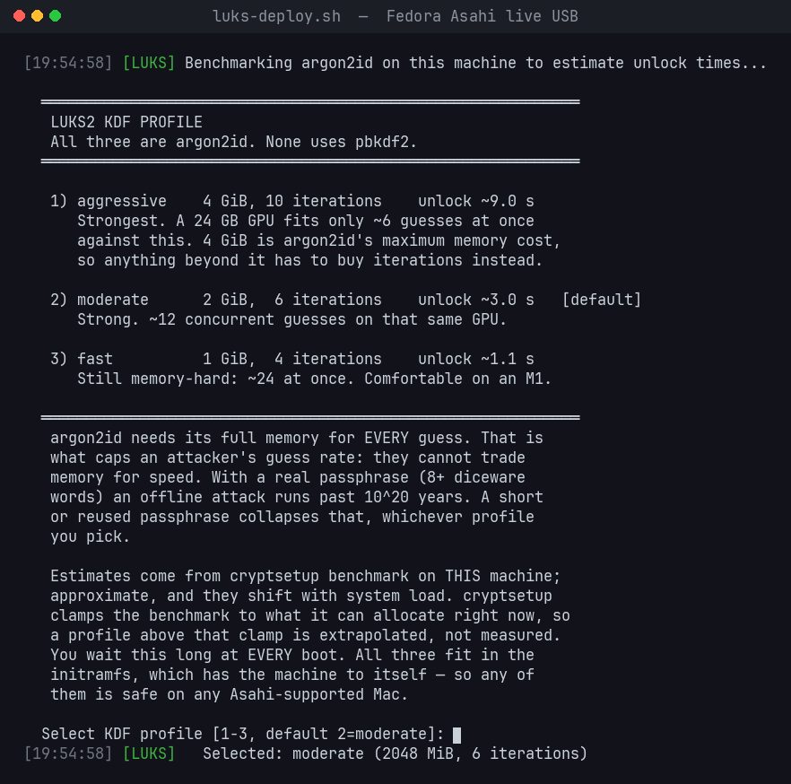

# AsahiLocker — in-place LUKS2 full-disk encryption for Fedora Asahi Remix on Apple Silicon

[](https://github.com/doug445/AsahiLocker/actions/workflows/lint.yml)
[](LICENSE)
[-lightgrey.svg)](#requirements)
[](#crypto-parameters--aes-256-xts-and-argon2id)

Encrypt the root filesystem of an **already-installed Fedora Asahi Remix** system
on Apple Silicon — in place, without reinstalling, without wiping macOS, and
without a second copy of your data.

`luks-deploy.sh` converts your existing btrfs root partition into a LUKS2
container holding that same filesystem. Your files, subvolumes, snapshots and
btrfs UUID all survive; the partition simply gains an encryption layer. It then
rewrites every piece of boot configuration that has to change (`crypttab`,
`fstab`, `/etc/kernel/cmdline`, GRUB defaults, **all** BLS entries, dracut
config, **all** initramfs images) and refuses to let you reboot until a 12-point
verification gate passes.

Works on every M-series Mac that Asahi supports — M1 / M1 Pro / M1 Max /
M1 Ultra, M2 / M2 Pro / M2 Max, M3, M4. Nothing in the tooling is model-specific:
partitions, subvolumes and boot layout are all auto-detected at runtime.

> **This is destructive-by-nature tooling.** It rewrites a live root filesystem.
> Read [`docs/INSTALL.md`](docs/INSTALL.md) before running anything, and have a
> verified backup. See [Risks](#risks--read-this).

---

## Quick start

```bash
# 1. On the installed system: get the kit, and build a Fedora Asahi live USB
#    to run it from  (see docs/LIVE-USB.md — a stock Fedora ISO will NOT boot)
git clone https://github.com/doug445/AsahiLocker.git

# 2. Boot the live USB. Easiest route, with the USB plugged in:
#      sudo grub2-mkconfig -o /boot/grub2/grub.cfg    # adds it to your GRUB menu
#    then reboot and select it.  (see docs/LIVE-USB.md for the U-Boot routes)

# 3. From the live environment, encrypt the installed root:
sudo ./AsahiLocker/bin/luks-deploy.sh

# 4. Reboot, enter your passphrase, then finish up on the encrypted system:
sudo ./AsahiLocker/bin/post-encryption-setup.sh
sudo ./AsahiLocker/boot-guards/install.sh
```

The deploy script auto-detects your disk layout and shows you what it found. You
confirm the selection, type `ENCRYPT`, and choose a passphrase. Everything after
that is automated, including recovery if a step fails partway.

Full walkthrough: **[docs/INSTALL.md](docs/INSTALL.md)**

---

## What you get

- **In-place btrfs → LUKS2 conversion.** No reinstall, no backup-and-restore
  round trip, no second disk. Subvolumes, snapshots and the btrfs UUID survive.
- **Pinned argon2id, never pbkdf2.** AES-256-XTS with argon2id at 4 / 2 / 1 GiB
  memory cost — memory-hard by design, so GPU and ASIC cracking stays expensive.
- **Benchmarked on *your* machine.** The installer measures your hardware and
  shows real unlock-latency estimates before you pick a KDF profile.
- **Every boot file rewritten, then verified.** `crypttab`, `fstab`,
  `/etc/kernel/cmdline`, GRUB defaults, all BLS entries, dracut config and all
  initramfs images — behind a 12-point gate that refuses to let you reboot into
  a broken system.
- **Resumable after any interruption.** LUKS2 re-encryption is journaled with
  checksum resilience; re-run the script and it detects the interrupted state
  and finishes it.
- **A `--dry-run` that really is dry.** The entire read-only half, including the
  exact `cryptsetup reencrypt` invocation it would issue, with nothing modified.
- **Recovery you can actually use.** Optional 64-hex recovery key in a second
  keyslot, plus a labeled bundle with the LUKS header and every changed config.
- **Asahi-specific boot guards.** Stops a stray `grub2-mkconfig` from bricking
  an encrypted boot, and clears U-Boot's stale EFI entries.
- **Tested in CI on every push**, x86_64 and aarch64, against a real loop device.

---

## What's in here

| Path | What it is |
|------|------------|
| `bin/luks-deploy.sh` | **The main event.** In-place LUKS2 encryption of the installed btrfs root, run from a live USB. Auto-detects everything, cross-checks the selected boot/EFI partitions against the target's own fstab, self-repairs failed initramfs/BLS steps, fixes SELinux labels, and gates the reboot behind 12 verification checks. Fully resumable: re-run it after any interruption and it finishes the encryption (`--resume-only`) or redoes just the config phase. |
| `bin/post-encryption-setup.sh` | Run once on the newly-encrypted system. Saves a recovery bundle, creates snapper subvolumes on the encrypted volume, enables the boot guards, verifies the result. Idempotent. |
| `bin/save-luks-recovery-bundle.sh` | Assembles a labeled recovery bundle (LUKS header + `crypttab`/`fstab`/`cmdline`/BLS entries + a plain-English recovery README) so you are not dependent on a second USB. |
| `bin/post-encryption.conf.example` | Optional config for the above — snapper subvolumes and any extra units you want enabled post-encryption. |
| `boot-guards/` | Two small Asahi-specific boot guards, plus an installer: **ESP stub guard** (stops a stray `grub2-mkconfig` from bricking an encrypted boot) and **stale EFI entry cleaner** (removes U-Boot's leftover entries for unplugged USB installers). |
| `extras/` | Optional `luks-fetch-cache`: an aligned LUKS/BitLocker status readout for fastfetch. Public header metadata only, no key material. |
| `tests/` | `loopback-core-test.sh`: runs the exact encrypt/resume/recovery-key sequence against a throwaway file-backed loop device — including a hard-kill mid-reencrypt followed by `cryptsetup repair` + `--resume-only`. Runs in CI on every push (x86_64 + aarch64); safe to run locally with sudo. |
| `docs/` | [INSTALL](docs/INSTALL.md) · [LIVE-USB](docs/LIVE-USB.md) · [RECOVERY](docs/RECOVERY.md) · [U-Boot bootflow](docs/UBOOT-BOOTFLOW.md) · [Internals](docs/INTERNALS.md) · [Fleet deployment](docs/FLEET.md) |

---

## How the encrypted boot actually works on Apple Silicon

```
iBoot → m1n1 stage 1 → m1n1 stage 2 → U-Boot → shim → GRUB → Linux
                                        │                 │
                       provides the UEFI environment      │
                                                          │
                        reads BLS entries from /boot/loader/entries/
                                                          ↓
                                            kernel + initramfs load
                                                          ↓
                                     initramfs reads rd.luks.uuid from the
                                     kernel cmdline, prompts for your
                                     passphrase, opens LUKS, mounts root
```

U-Boot is the firmware/UEFI layer on Apple Silicon; GRUB is the bootloader
running on top of it. Both are in the chain on Fedora Asahi Remix.

**`/boot` stays unencrypted** (plain ext4) so GRUB can read kernels and
initramfs images. The encrypted root is unlocked by the *initramfs*, not by
GRUB. `/boot` encryption is deliberately out of scope — see
[docs/INTERNALS.md](docs/INTERNALS.md#why-boot-stays-unencrypted).

### Partition layout, before and after

```
nvme0n1
  p1  APFS    iBootSystemContainer
  p2  APFS    macOS  ← untouched
  p3  APFS
  p4  vfat    EFI          → /boot/efi   ← stays plain
  p5  ext4    BOOT         → /boot       ← stays plain
  p6  btrfs   fedora       → / and /home ← becomes LUKS2(btrfs)
  p7  APFS    RecoveryOS
```

Partition *numbers* are auto-detected; this is just the common Asahi shape.

---

## Crypto parameters — AES-256-XTS and argon2id

Pinned explicitly rather than left to `cryptsetup`'s auto-benchmark, so every box
you deploy to ends up identical instead of picking a machine-dependent memory
cost and sha256.

| Parameter | Value |
|-----------|-------|
| Cipher | `aes-xts-plain64`, 512-bit key (AES-256-XTS) |
| KDF | argon2id (always — no profile selects pbkdf2) |
| Memory cost | 4 / 2 / 1 GiB, by profile |
| Iterations (time cost) | 10 / 8 / 4, by profile |
| Parallelism | 4 threads |
| Hash | sha512 — sets both the AF splitter hash and the LUKS2 volume-key digest |

The KDF re-runs **in the initramfs at every boot**, so its memory cost must be
allocatable there — and you pay its full cost as unlock latency on every boot.

### Choosing an argon2id profile

Because you wait for it every time you start the machine, the installer asks you
to pick one of three profiles. It **benchmarks your machine first** and shows a
real measured estimate for each — not numbers from someone else's hardware:



*Times shown are from an M2 Max. Your machine is benchmarked at run time, so the
numbers you see will be your own.*

| Profile | Memory | Iterations | Threads |
|---------|--------|-----------|---------|
| `aggressive` | 4 GiB | 10 | 4 |
| `moderate` (default) | 2 GiB | 8 | 4 |
| `fast` | 1 GiB | 4 | 4 |

**All three are argon2id — none uses pbkdf2.** Memory cost only has to be
allocatable in the initramfs, which has the machine to itself, so any profile is
safe on any Asahi-supported Mac including an 8 GiB M1.

argon2id is memory-bandwidth-bound, so a base M1 is slower than an M2 Max for
identical parameters — which is exactly why the installer measures your hardware
rather than assuming.

Non-interactive selection, for scripted or fleet deployments:

```bash
sudo LUKS_PROFILE=fast ./bin/luks-deploy.sh                     # a named profile
sudo LUKS_PBKDF_MEMORY=1572864 LUKS_PBKDF_ITER=6 ./bin/luks-deploy.sh   # fully custom
```

Setting any `LUKS_PBKDF_*` variable pins the parameters and skips the menu.
Custom parameters below half the `fast` profile (512 MiB / 4 iterations) are
refused unless you also set `LUKS_PBKDF_ACK_WEAK=1` — a typo in the memory
figure should not silently produce a worthless KDF.

The partition menus can be pinned the same way (each pinned device is still
fstype-checked and cross-checked against the target's own fstab, and the typed
`ENCRYPT` confirmation still applies):

```bash
sudo LUKS_TARGET_ROOT=/dev/nvme0n1p6 LUKS_TARGET_BOOT=/dev/nvme0n1p5 \
     LUKS_TARGET_EFI=/dev/nvme0n1p4 ./bin/luks-deploy.sh
```

Fully hands-off (fleet imaging, automated testing): `LUKS_PASSPHRASE_FILE=<path>`
reads the passphrase from a file — its exact bytes, no trailing newline — and is
used for encrypt, resume, unlock, and as the existing key when enrolling the
recovery key. `LUKS_MAPPER_NAME=<name>` changes the device-mapper name (default
`fedora_crypt`; the companion scripts auto-detect a custom name from the booted
system).

### Dry run

```bash
sudo ./bin/luks-deploy.sh --dry-run     # or LUKS_DRY_RUN=1
```

Runs the entire read-only half — detection, selection menus, fstab
cross-checks, the KDF benchmark, the state backup to the deployment drive —
prints exactly what a real run would do (including the full
`cryptsetup reencrypt` invocation), and exits before the point of no return.
Nothing on the target is modified.

### Boot splash

The deploy strips `rhgb quiet` from the boot args, because with the splash
active the first LUKS passphrase prompt hides behind it and the boot looks
hung. `post-encryption-setup.sh` restores both tokens after the first
encrypted boot (via a marker in `/var/lib/asahilocker/`). Opt out
with `LUKS_KEEP_SPLASH=1`.

### Recovery key

During deployment the script offers to enroll a **recovery key**: 64 random hex
characters in a second LUKS keyslot, saved to the deployment drive (pin the
choice with `LUKS_RECOVERY_KEY=yes|no`). If the passphrase is ever forgotten,
the recovery key still unlocks the volume — type it at the boot prompt, or use
it as a `--key-file` from a live USB. It is enrolled *before* the header backup
is taken, so the backup contains the slot. **Move it to secure offline storage
after deployment** — anyone holding it can unlock the disk.

**Stay on argon2id.** It is memory-hard, which is the entire point — that is what
makes GPU and ASIC cracking expensive. Never substitute pbkdf2 to save memory or
time; argon2id at 1 GiB is dramatically stronger than pbkdf2 at any iteration
count. Verify what you got with `cryptsetup luksDump /dev/nvme0n1p6`.

> **Note on GRUB and argon2id:** none of this constrains the root volume, because
> GRUB never unlocks it — the initramfs does. It only matters if you have some
> *other* volume that GRUB itself must unlock: GRUB ≥ 2.13 does argon2id but is
> capped by its own heap at roughly 1 GiB memory cost, and GRUB 2.12 (current in
> Fedora 44) has no argon2 support at all. Do not answer that by downgrading the
> volume to pbkdf2 — argon2id at 1 GiB is memory-hard, pbkdf2 is not, and the gap
> matters far more than the memory cost does.

---

## How this differs from encrypting by hand

The manual route — `cryptsetup reencrypt` followed by editing `crypttab`,
`fstab`, the kernel cmdline, GRUB defaults and the BLS entries yourself — works,
and there are guides for it. What this kit adds is the part those guides leave
to you:

| | Manual `cryptsetup reencrypt` | AsahiLocker |
|---|---|---|
| Partition selection | You identify root/boot/EFI yourself | Auto-detected, fstype-checked, and cross-checked against the target's own fstab |
| KDF parameters | `cryptsetup` auto-benchmarks — machine-dependent, and picks sha256 | Pinned argon2id + sha512, identical on every box, chosen from a menu benchmarked on your hardware |
| Boot config | You edit `crypttab`, `fstab`, cmdline, GRUB defaults and every BLS entry by hand | All rewritten, including *every* BLS entry and *every* initramfs image |
| Did it work? | You find out at reboot | 12-point verification gate refuses the reboot until it passes |
| Interrupted run | You debug the header state yourself | Detected and resumed automatically; `cryptsetup repair` path handled |
| SELinux | Relabel it yourself or boot to AVC denials | Relabelled and verified |
| Undo / recovery | Whatever you thought to save | Header backups plus a labeled bundle of every changed file |
| The Asahi footguns | `grub2-mkconfig` clobbering the ESP stub; stale U-Boot EFI entries | Boot guards install to prevent both |

If you want to understand what it changes before trusting it, `--dry-run` prints
every action, and [docs/INTERNALS.md](docs/INTERNALS.md) documents each one.

---

## Risks — read this

- **No TPM on Apple Silicon.** There is nowhere to seal a key, so you type the
  passphrase at *every* boot. That is by design, not a limitation of this tooling.
- **Forget the passphrase and the data is gone** — unless you enrolled the
  optional recovery key and can still find it. There is no backdoor. Back up the
  recovery bundle, keep the recovery key offline, and remember the passphrase.
- **Have a verified backup before you start.** Not "a backup" — one you have
  actually restored from or browsed. In-place re-encryption rewrites every sector
  of the root partition.
- **You cannot brick the Mac.** Apple Silicon DFU / System Recovery always works,
  and macOS is on separate APFS partitions this tooling never touches. An
  interrupted encryption is not fatal either: LUKS2 re-encryption is journaled
  with checksum resilience, and re-running the script detects the interrupted
  state and resumes it automatically. The header backups cover the remaining
  worst case of a damaged header.
- **LUKS protects data at rest, not boot integrity.** Only m1n1 stage 1 is
  cryptographically verified on Asahi; `/boot` is unencrypted and unsigned. An
  attacker with repeated physical access could tamper with the initramfs.
- **The passphrase prompt can hide behind boot text.** If the machine looks hung
  right after GRUB, it is probably waiting — type the passphrase and press Enter.
  Splash screen is disabled during 1st post-conversion boot, so prompt should be visible.

---

## Requirements

- An **already-installed** Fedora Asahi Remix system with a **btrfs** root.
- A **Fedora Asahi live USB** to run the encryption from — the script refuses to
  encrypt the filesystem it is booted from. A stock Fedora ISO will not boot on
  Apple Silicon; build one with
  [`asahi-fedora-usb`](https://github.com/leifliddy/asahi-fedora-usb) as described
  in [docs/LIVE-USB.md](docs/LIVE-USB.md).
- AC power connected (the script enforces AC or >50% battery).
- `cryptsetup` ≥ 2.4 (for `reencrypt --encrypt`), `btrfs-progs`, `dracut`,
  `grubby` — all present in the live environment.
- 15–60 minutes, depending on partition size.

The core script also works on Fedora x86_64, Arch and Manjaro with btrfs roots;
the boot guards and U-Boot documentation are Asahi-specific.

---

## Frequently asked questions

### Can I encrypt Fedora Asahi Remix *after* installing it?

Yes — that is exactly what this is for. The Asahi installer has no full-disk
encryption option, so encrypting normally means starting over. `luks-deploy.sh`
converts the existing btrfs root in place instead, so your installed system,
subvolumes, snapshots and btrfs UUID all survive.

### Does this touch or wipe macOS?

No. macOS lives on separate APFS partitions that this tooling never reads or
writes. Only the btrfs Linux root partition is converted. Apple Silicon DFU and
System Recovery remain available regardless.

### Why do I have to type a passphrase at every boot? Can't it use the Secure Enclave?

There is no TPM on Apple Silicon, and Asahi has no interface to seal a key in the
Secure Enclave, so there is nowhere to store an auto-unlock key that would still
be safe. The KDF re-runs in the initramfs on every boot and you type the
passphrase. That is a platform constraint, not a shortcoming of this kit.

### argon2id or pbkdf2 for LUKS2?

argon2id, always. It is *memory-hard*: cracking it requires gigabytes of RAM per
guess, which is what makes GPU and ASIC attacks expensive. pbkdf2 is not, so it
parallelises cheaply on a GPU. argon2id at 1 GiB is dramatically stronger than
pbkdf2 at any iteration count. No profile here selects pbkdf2.

### Why is `/boot` left unencrypted?

GRUB has to read the kernel and initramfs before anything is unlocked. The
encrypted root is opened by the *initramfs*, not by GRUB, so keeping `/boot`
plain avoids putting GRUB on the unlock path at all — where it would be capped
by its own heap (roughly 1 GiB argon2id memory cost on GRUB ≥ 2.13, and no
argon2 support at all in GRUB 2.12, which is current in Fedora 44). The trade-off
is that `/boot` is unsigned; see [Risks](#risks--read-this).

### What happens if the encryption is interrupted — power loss, a crash, a closed lid?

Nothing fatal. LUKS2 re-encryption is journaled with checksum resilience. Re-run
`luks-deploy.sh` and it detects the interrupted state and resumes it
(`--resume-only`), running `cryptsetup repair` first if the journal is dirty.
That exact sequence — including a hard kill mid-reencrypt — is what the CI
loopback test exercises on every push.

### Can I run it unattended across several machines?

Yes. `LUKS_PROFILE` or the `LUKS_PBKDF_*` variables pin the KDF,
`LUKS_TARGET_ROOT` / `_BOOT` / `_EFI` pin the partitions, and
`LUKS_PASSPHRASE_FILE` supplies the passphrase, so no menu appears. Read
[docs/FLEET.md](docs/FLEET.md) first — there is a real UUID-uniqueness footgun
when imaging several boxes from one source.

### Will this work on an M1 with only 8 GB of RAM?

Yes, on any profile including `aggressive` at 4 GiB. The memory cost only has to
be allocatable in the initramfs, which has the machine entirely to itself. A base
M1 is slower than an M2 Max at identical parameters because argon2id is
memory-bandwidth-bound — which is why the installer benchmarks your machine
instead of quoting someone else's numbers.

### Does it work on anything other than Asahi?

The core script also runs on Fedora x86_64, Arch and Manjaro with btrfs roots.
The boot guards and the U-Boot documentation are Apple-Silicon-specific.

### How do I check what I actually ended up with?

```bash
sudo cryptsetup luksDump /dev/nvme0n1p6
```

Look for `Cipher: aes-xts-plain64`, a 512-bit key, and `PBKDF: argon2id` with
the memory and iteration figures from the profile you chose.

---

## Documentation

| Doc | Covers |
|-----|--------|
| [INSTALL.md](docs/INSTALL.md) | Step-by-step install, start to finish, with what each prompt means |
| [LIVE-USB.md](docs/LIVE-USB.md) | Building a Fedora Asahi live USB, and the three ways to boot it |
| [RECOVERY.md](docs/RECOVERY.md) | Interrupted encryption, unbootable system, corrupt header, undoing a shrink |
| [UBOOT-BOOTFLOW.md](docs/UBOOT-BOOTFLOW.md) | Getting to the U-Boot prompt and booting the live USB |
| [INTERNALS.md](docs/INTERNALS.md) | Every config file changed, the 12-point gate, self-repair, why `/boot` stays plain |
| [FLEET.md](docs/FLEET.md) | Deploying across several M-series boxes, and the UUID-uniqueness footgun |

---

## Contributing

Bug reports and patches are welcome — open an
[issue](https://github.com/doug445/AsahiLocker/issues) or a pull request. If you
are reporting a failed deployment, the output of `sudo ./bin/luks-deploy.sh
--dry-run` and `sudo cryptsetup luksDump <device>` is the most useful thing to
include. Shell changes should pass `shellcheck -S warning`, which CI enforces.

## License and contact

MIT — see [LICENSE](LICENSE).

- **Author:** [doug445](https://github.com/doug445)
- **Email:** spilled-bowline0j@icloud.com
- **Repository:** https://github.com/doug445/AsahiLocker

Copyright (c) 2026 https://github.com/doug445 [spilled-bowline0j@icloud.com]
