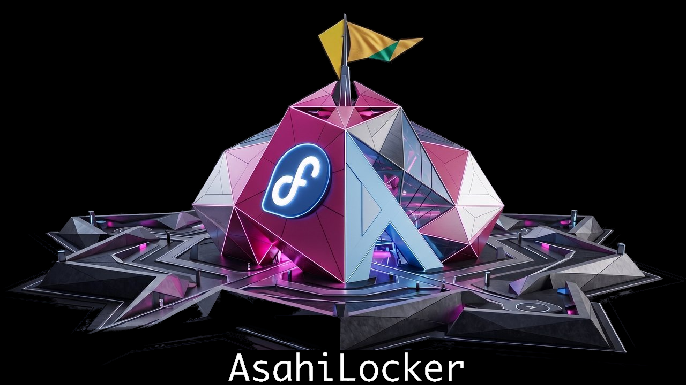

<p align="center">
  
</p>

# AsahiLocker — in-place LUKS2 disk encryption for Fedora Asahi Remix on Apple Silicon

[](https://github.com/doug445/AsahiLocker/actions/workflows/lint.yml)
[](LICENSE)
[-lightgrey.svg)](docs/COMPATIBILITY.md)
[](#crypto-parameters--aes-256-xts-and-argon2id)

Encrypt the root filesystem of an **already-installed Fedora Asahi Remix** system
on Apple Silicon — in place, without reinstalling, without wiping macOS, and
without a second copy of your data.

`luks-deploy.sh` converts your existing btrfs root partition into a LUKS2
container holding that same filesystem. Your files, subvolumes, snapshots and
btrfs UUID all survive; the partition simply gains an encryption layer. It then
rewrites every piece of boot configuration that has to change (`crypttab`,
`fstab`, `/etc/kernel/cmdline`, GRUB defaults, **all** BLS entries, dracut
config, **all** initramfs images) and refuses to let you reboot until a 12-point
verification gate passes.

Built for every M-series Mac that Fedora Asahi Remix boots — laptop or
desktop: MacBook Air and Pro, Mac mini, Mac Studio, iMac and the 2023 Mac Pro,
across M1, M2 and M3 and their Pro / Max / Ultra variants. Nothing in the
tooling is model-specific: partitions, subvolumes, the boot layout, the disk's
sector size and the initramfs contents are all read at run time. Which machines
are verified, which are expected to work, and what changes on a desktop (a
Bluetooth keyboard cannot type the passphrase; there is no battery to ride out
a mains dip) is in **[docs/COMPATIBILITY.md](docs/COMPATIBILITY.md)**. M4 is
not claimed: the kernel ships its device trees, but Asahi does not boot it yet.

> **This is destructive-by-nature tooling.** It rewrites a live root filesystem.
> Read [`docs/INSTALL.md`](docs/INSTALL.md) before running anything, and have a
> verified backup. See [Risks](#risks--read-this).

---

## Quick start

```bash
# 1. On the installed system: get the kit, and build a Fedora Asahi live USB
#    to run it from  (see docs/LIVE-USB.md — a stock Fedora ISO will NOT boot)
git clone https://github.com/doug445/AsahiLocker.git

# 2. Boot the live USB. Easiest route, with the USB plugged in:
#      sudo grub2-mkconfig -o /boot/grub2/grub.cfg    # adds it to your GRUB menu
#      (-o must be exactly that path — NEVER the ESP grub.cfg; see docs/LIVE-USB.md)
#    then reboot and select it.  (see docs/LIVE-USB.md for the U-Boot routes)
#    Stick not showing up at the U-Boot prompt? Run `usb start` first.
#    Still nothing? Use a second minimal Asahi install instead — the rest of
#    these steps are identical.  (see docs/SECOND-INSTALL.md)

# 3. From the live environment, encrypt the installed root:
sudo ./AsahiLocker/bin/luks-deploy.sh

# 4. Reboot, enter your passphrase, then finish up on the encrypted system:
sudo ./AsahiLocker/bin/post-encryption-setup.sh
sudo ./AsahiLocker/boot-guards/install.sh
```

The deploy script auto-detects your disk layout and shows you what it found. You
confirm the selection, type `ENCRYPT`, and choose a passphrase. Everything after
that is automated, including recovery if a step fails partway.

Full walkthrough: **[docs/INSTALL.md](docs/INSTALL.md)**

---

## What you get

- **In-place btrfs → LUKS2 conversion.** No reinstall, no backup-and-restore
  round trip, no second disk. Subvolumes, snapshots and the btrfs UUID survive.
- **Pinned argon2id, never pbkdf2.** AES-256-XTS with argon2id at 4 / 2 / 1 GiB
  memory cost — memory-hard by design, so GPU and ASIC cracking stays expensive.
- **Every profile is stronger than `cryptsetup`'s own defaults — enforced, not
  asserted.** The weakest profile on offer does 1.125x the work of a plain
  `luksFormat` on the same machine, and the strongest does 5x. Before it writes
  anything the installer benchmarks what `cryptsetup` would have chosen unaided
  and refuses to ship weaker: a named profile below that bar is raised past it,
  pinned parameters below it are fatal. There is no flag to opt out.
- **Benchmarked on *your* machine.** The installer measures your hardware and
  shows real unlock-latency estimates before you pick a KDF profile.
- **Every boot file rewritten, then verified.** `crypttab`, `fstab`,
  `/etc/kernel/cmdline`, GRUB defaults, all BLS entries, dracut config and all
  initramfs images — behind a 12-point gate that refuses to let you reboot into
  a broken system.
- **Resumable after any interruption.** LUKS2 re-encryption is journaled with
  checksum resilience; re-run the script and it detects the interrupted state
  and finishes it.
- **A `--dry-run` that really is dry.** The entire read-only half, including the
  exact `cryptsetup reencrypt` invocation it would issue, with nothing modified.
- **Recovery you can actually use.** Optional 64-hex recovery key in a second
  keyslot, plus a labeled bundle with the LUKS header and every changed config.
- **Asahi-specific boot guards.** Stops a stray `grub2-mkconfig` from bricking
  an encrypted boot, and clears U-Boot's stale EFI entries — in the file they
  actually live in (`ubootefi.var` on the ESP), which a runtime `efibootmgr`
  delete never reaches.
- **Tested in CI on every push**, x86_64 and aarch64, against a real loop device.

---

## What's in here

| Path | What it is |
|------|------------|
| `bin/luks-deploy.sh` | **The main event.** In-place LUKS2 encryption of the installed btrfs root, run from a live USB or a [second minimal Asahi install](docs/SECOND-INSTALL.md). Auto-detects everything, excludes the partitions of whatever system it is running from and refuses them as targets, cross-checks the selected boot/EFI partitions against the target's own fstab, self-repairs failed initramfs/BLS steps, fixes SELinux labels, and gates the reboot behind 12 verification checks. Fully resumable: re-run it after any interruption and it finishes the encryption (`--resume-only`) or redoes just the config phase. |
| `bin/post-encryption-setup.sh` | Run once on the newly-encrypted system. Saves a recovery bundle, creates snapper subvolumes on the encrypted volume, enables the boot guards, verifies the result. Idempotent. |
| `bin/luks-tune.sh` | An ncurses front-end (`dialog`, falling back to `whiptail`) for inspecting and re-costing the argon2id parameters of keyslots on volumes that already exist. Shows the measured unlock time and what the cost buys against a GPU fleet before you commit, backs the header up first, and hands the passphrase prompt to `cryptsetup` rather than reading it. Pins `--hash sha512` so a re-cost cannot walk a slot's AF hash back to cryptsetup's `sha256` default. Never creates or destroys a keyslot, never changes a passphrase, never touches data. `--dry-run` prints the command and changes nothing. |
| `bin/save-luks-recovery-bundle.sh` | Labeled recovery bundle: a fresh, **verified** header backup of **every** LUKS volume on the machine (not just root), the public `luksDump` of each, the **partition table** of every disk holding one (`sfdisk --dump`, so a header backup is never a puzzle about offsets), crypttab/fstab/every command-line carrier/boot entries/EFI boot variables, sha256 sums, and a README with the repair steps for this machine's initramfs style and the checks to make before any header is restored. Refreshes a stale `/boot` emergency copy (keeping the old one). Key files named in crypttab are listed, never copied. `--dry-run` writes nothing. **Key material — never attach it to a bug report.** |
| `bin/post-encryption.conf.example` | Optional config for the above — snapper subvolumes and any extra units you want enabled post-encryption. |
| `boot-guards/` | Two small Asahi-specific boot guards, plus an installer: **ESP stub guard** (stops a stray `grub2-mkconfig` from bricking an encrypted boot) and **stale EFI entry cleaner** (removes U-Boot's leftover entries for unplugged USB installers — from `ubootefi.var` on the ESP, where they actually live; `uboot-efivar.py` reads and edits that file). |
| `extras/` | Optional `luks-fetch-cache`: an aligned LUKS/BitLocker status readout for fastfetch. Public header metadata only, no key material. |
| `tests/` | `loopback-core-test.sh`: runs the exact encrypt/resume/recovery-key sequence against a throwaway file-backed loop device — including a hard-kill mid-reencrypt followed by `cryptsetup repair` + `--resume-only`. `multi-install-selection-test.sh`: builds a sparse two-install disk and checks the partition menus exclude the running system, recommend the right root, and pair boot/EFI with it. Both run in CI on every push (x86_64 + aarch64); safe to run locally with sudo. |
| `docs/` | [COMPATIBILITY](docs/COMPATIBILITY.md) · [INSTALL](docs/INSTALL.md) · [LIVE-USB](docs/LIVE-USB.md) · [SECOND-INSTALL](docs/SECOND-INSTALL.md) · [RECOVERY](docs/RECOVERY.md) · [CRYPTO](docs/CRYPTO.md) · [FAQ](docs/FAQ.md) · [U-Boot bootflow](docs/UBOOT-BOOTFLOW.md) · [Internals](docs/INTERNALS.md) · [Fleet deployment](docs/FLEET.md) · [Encrypted /boot research](docs/BOOT-ENCRYPTION-STATUS.md) |
| `tools/boot-probe/` | **Research only, not part of any install.** Builds throwaway LUKS containers and a self-contained GRUB 2.14 image to measure what argon2id can actually do inside GRUB under U-Boot. Touches no real volume. See [BOOT-ENCRYPTION-STATUS.md](docs/BOOT-ENCRYPTION-STATUS.md). |

---

## How the encrypted boot actually works on Apple Silicon

```
iBoot → m1n1 stage 1 → m1n1 stage 2 → U-Boot → shim → GRUB → Linux
                                        │                 │
                       provides the UEFI environment      │
                                                          │
                        reads BLS entries from /boot/loader/entries/
                                                          ↓
                                            kernel + initramfs load
                                                          ↓
                                     initramfs reads rd.luks.uuid from the
                                     kernel cmdline, prompts for your
                                     passphrase, opens LUKS, mounts root
```

U-Boot is the firmware/UEFI layer on Apple Silicon; GRUB is the bootloader
running on top of it. Both are in the chain on Fedora Asahi Remix.

**`/boot` stays unencrypted** (plain ext4) so GRUB can read kernels and
initramfs images. The encrypted root is unlocked by the *initramfs*, not by
GRUB — see [docs/INTERNALS.md](docs/INTERNALS.md#why-boot-stays-unencrypted).

> Encrypting `/boot` is being **researched**, and the work so far is written up
> in **[docs/BOOT-ENCRYPTION-STATUS.md](docs/BOOT-ENCRYPTION-STATUS.md)** —
> including measurements on real hardware showing GRUB's argon2id is **8.5×
> slower than the kernel's**, and a reproducible **hard reset** past a certain
> computation length. It is **not shipped, not enabled, and has no flag**; every
> released version encrypts root only. Contributions and probe results from
> other Apple Silicon machines are wanted — the open questions are listed at the
> end of that document.

### Partition layout, before and after

```
nvme0n1
  p1  APFS    iBootSystemContainer
  p2  APFS    macOS  ← untouched
  p3  APFS
  p4  vfat    EFI          → /boot/efi   ← stays plain
  p5  ext4    BOOT         → /boot       ← stays plain
  p6  btrfs   fedora       → / and /home ← becomes LUKS2(btrfs)
  p7  APFS    RecoveryOS
```

Partition *numbers* are auto-detected; this is just the common Asahi shape.

---

## Crypto parameters — AES-256-XTS and argon2id

Pinned explicitly rather than left to `cryptsetup`'s auto-benchmark, so every box
you deploy to ends up identical instead of picking a machine-dependent memory
cost and sha256.

| Parameter | Value |
|-----------|-------|
| Cipher | `aes-xts-plain64`, 512-bit key (AES-256-XTS) |
| KDF | argon2id (always — no profile selects pbkdf2) |
| Memory cost | 4 / 2 / 1 GiB, by profile |
| Iterations (time cost) | 10 / 8 / 9 — aggressive / moderate / `fast` |
| Parallelism | 4 threads |
| Hash | sha512 — sets both the AF splitter hash and the LUKS2 volume-key digest |
| Encryption sector | **4096 bytes** when the btrfs sectorsize allows it (it does on every Asahi install), else 512. Apple NVMe is a 4096-byte-sector disk and btrfs writes 4096-byte blocks; cryptsetup's default of 512 made every filesystem block eight XTS blocks with eight IVs. Verified in place for 4096-byte and 512-byte devices alike; `LUKS_SECTOR_SIZE=512` pins the old value. cryptsetup refuses 4096-byte sectors on a partition whose size is not a multiple of 4096 — and on a 512-byte-sector GPT disk the last partition never is (GPT reserves 33 sectors at the end of the disk). The script then asks: type `ALIGN` to move the partition's end down by those few bytes (the table is backed up first; type, name, GUID and attributes are kept; the filesystem, already 32 MiB smaller, loses nothing), or press Enter for 512-byte sectors. `LUKS_ALIGN_PARTITION=yes\|no` answers it non-interactively. On Apple's 4096-byte-sector NVMe the question never comes up |

The KDF re-runs **in the initramfs at every boot**, so its memory cost must be
allocatable there — and you pay its full cost as unlock latency on every boot.

### Choosing an argon2id profile

The installer **benchmarks your machine** and offers three profiles, with an
estimate for each taken from your own hardware rather than someone else's. All
three are argon2id — no profile selects pbkdf2 — and all three are stronger
than what `cryptsetup` picks for itself, which a runtime guard enforces rather
than assumes.

| Profile | Memory | Iterations | Threads | Unlock, M2 Max | vs stock |
|---------|--------|-----------|---------|----------------|----------|
| `aggressive` | 4 GiB | 10 | 4 | **9.5 s** (measured) | 5x |
| `moderate` (default) | 2 GiB | 8 | 4 | ~3.8 s | 2x |
| `fast` | 1 GiB | 9 | 4 | ~2.1 s | 1.125x |


*Times shown are from an M2 Max. Your machine is benchmarked at run time, so the
numbers you see will be your own.*

**Pick `aggressive` unless you have a reason not to.** You pay the KDF once per
boot; an attacker with an image of your disk pays it once per guess. Memory cost
only has to be allocatable in the initramfs, which has the machine to itself, so
every profile is safe on any Asahi-supported Mac including an 8 GiB M1.

**[docs/CRYPTO.md](docs/CRYPTO.md)** has the rest: the full case for
`aggressive` and what a `paranoid` profile would buy, [changing the KDF on a
volume that already exists](docs/CRYPTO.md#changing-the-kdf-on-a-volume-that-already-exists),
[why nothing here uses pbkdf2](docs/CRYPTO.md#never-use-pbkdf2), [how this
compares with FileVault on the same
disk](docs/CRYPTO.md#how-this-compares-with-filevault--the-kdf-macos-gives-the-same-disk),
[how much your passphrase actually
contributes](docs/CRYPTO.md#your-passphrase-is-the-other-half), and the GRUB
argon2id constraints.

---

## Deployment options

### Dry run

```bash
sudo ./bin/luks-deploy.sh --dry-run     # or LUKS_DRY_RUN=1
```

Runs the entire read-only half — detection, selection menus, fstab
cross-checks, the KDF benchmark, the state backup to the deployment drive —
prints exactly what a real run would do (including the full
`cryptsetup reencrypt` invocation), and exits before the point of no return.
Nothing on the target is modified.

### Boot splash

The deploy strips `rhgb quiet` from the boot args, because with the splash
active the first LUKS passphrase prompt hides behind it and the boot looks
hung. `post-encryption-setup.sh` restores both tokens after the first
encrypted boot (via a marker in `/var/lib/asahilocker/`). Opt out
with `LUKS_KEEP_SPLASH=1`.

### Recovery key

During deployment the script offers to enroll a **recovery key**: 64 random hex
characters in a second LUKS keyslot, saved to the deployment drive (pin the
choice with `LUKS_RECOVERY_KEY=yes|no`). If the passphrase is ever forgotten,
the recovery key still unlocks the volume — type it at the boot prompt, or use
it as a `--key-file` from a live USB. It is enrolled *before* the header backup
is taken, so the backup contains the slot. **Move it to secure offline storage
after deployment** — anyone holding it can unlock the disk.

> GRUB's own argon2id limits — the 4 GiB overflow, the firmware-dependent
> ceiling below it — do not constrain the root volume, because GRUB never
> unlocks it. They only matter for a volume GRUB itself must open, such as the
> encrypted-`/boot` research. See
> [docs/CRYPTO.md → GRUB and argon2id](docs/CRYPTO.md#grub-and-argon2id).

---

## How this differs from encrypting by hand

The manual route — `cryptsetup reencrypt` followed by editing `crypttab`,
`fstab`, the kernel cmdline, GRUB defaults and the BLS entries yourself — works,
and there are guides for it. What this kit adds is the part those guides leave
to you:

| | Manual `cryptsetup reencrypt` | AsahiLocker |
|---|---|---|
| Partition selection | You identify root/boot/EFI yourself | Auto-detected, fstype-checked, and cross-checked against the target's own fstab |
| KDF parameters | `cryptsetup` auto-benchmarks — machine-dependent, and picks sha256 | Pinned argon2id + sha512, identical on every box, chosen from a menu benchmarked on your hardware |
| Boot config | You edit `crypttab`, `fstab`, cmdline, GRUB defaults and every BLS entry by hand | All rewritten, including *every* BLS entry and *every* initramfs image |
| Did it work? | You find out at reboot | 12-point verification gate refuses the reboot until it passes |
| Interrupted run | You debug the header state yourself | Detected and resumed automatically; `cryptsetup repair` path handled |
| SELinux | Relabel it yourself or boot to AVC denials | Relabelled and verified |
| Undo / recovery | Whatever you thought to save | Header backups plus a labeled bundle of every changed file |
| The Asahi footguns | `grub2-mkconfig` clobbering the ESP stub; stale U-Boot EFI entries | Boot guards install to prevent both |

If you want to understand what it changes before trusting it, `--dry-run` prints
every action, and [docs/INTERNALS.md](docs/INTERNALS.md) documents each one.

---

## Risks — read this

- **No TPM on Apple Silicon.** There is nowhere to seal a key, so you type the
  passphrase at *every* boot. That is by design, not a limitation of this tooling.
- **Forget the passphrase and the data is gone** — unless you enrolled the
  optional recovery key and can still find it. There is no backdoor. Back up the
  recovery bundle, keep the recovery key offline, and remember the passphrase.
- **Have a verified backup before you start.** Not "a backup" — one you have
  actually restored from or browsed. In-place re-encryption rewrites every sector
  of the root partition.
- **You cannot brick the Mac.** Apple Silicon DFU / System Recovery always works,
  and macOS is on separate APFS partitions this tooling never touches. An
  interrupted encryption is not fatal either: LUKS2 re-encryption is journaled
  with checksum resilience, and re-running the script detects the interrupted
  state and resumes it automatically. The header backups cover the remaining
  worst case of a damaged header.
- **LUKS protects data at rest, not boot integrity.** Only m1n1 stage 1 is
  cryptographically verified on Asahi; `/boot` is unencrypted and unsigned. An
  attacker with repeated physical access could tamper with the initramfs.
- **The passphrase prompt can hide behind boot text.** If the machine looks hung
  right after GRUB, it is probably waiting — type the passphrase and press Enter.
  (The deploy strips the boot splash, and `post-encryption-setup.sh` restores
  it, precisely so this prompt stays visible on the first encrypted boots.)

---

## Requirements

- An **already-installed** Fedora Asahi Remix system with a **btrfs** root.
- Somewhere to run the encryption **from** — the script refuses to encrypt the
  filesystem it is booted from, and there is no override for that one.
  Either works:
  - a **Fedora Asahi live USB**. A stock Fedora ISO will not boot on Apple
    Silicon; build one with
    [`asahi-fedora-usb`](https://github.com/leifliddy/asahi-fedora-usb) as
    described in [docs/LIVE-USB.md](docs/LIVE-USB.md). If the stick looks dead
    at the U-Boot prompt, try `usb start` before anything else — an
    unenumerated, unpowered port is the usual cause.
  - a **second, minimal Asahi install** on the internal disk, for machines that
    genuinely will not boot USB. The deploy script excludes the running
    install's partitions from every menu and refuses them as targets, so the
    shared-disk hazard is handled — see
    [docs/SECOND-INSTALL.md](docs/SECOND-INSTALL.md).
- AC power connected (the script enforces AC or >50% battery).
- `cryptsetup` ≥ 2.4 (for `reencrypt --encrypt`), `btrfs-progs`, `dracut`,
  `grubby` — all present in the live environment.
- 15–60 minutes, depending on partition size.

This is Apple Silicon tooling: the boot guards, the ESP stub handling and the
U-Boot documentation all assume the m1n1 → U-Boot → GRUB chain. The core
encryption script does run on Fedora x86_64, Arch and Manjaro with btrfs roots,
but that is not where it is developed or tested first.

**If you are not on Apple Silicon, use
[LinuxLocker](https://github.com/doug445/LinuxLocker) instead** — the same
in-place LUKS2 approach, written for everything else: it detects the distro,
filesystem and boot stack, handles systemd-boot as well as GRUB, and rebuilds
and re-signs Unified Kernel Images for Secure Boot.

---

## Frequently asked questions

Every question and its full answer is in **[docs/FAQ.md](docs/FAQ.md)**:

- [Can I encrypt Fedora Asahi Remix *after* installing it?](docs/FAQ.md#can-i-encrypt-fedora-asahi-remix-after-installing-it)
- [Does this touch or wipe macOS?](docs/FAQ.md#does-this-touch-or-wipe-macos)
- [Why do I have to type a passphrase at every boot? Can't it use the Secure Enclave?](docs/FAQ.md#why-do-i-have-to-type-a-passphrase-at-every-boot-cant-it-use-the-secure-enclave)
- [Which KDF does this use, and can I change it?](docs/FAQ.md#which-kdf-does-this-use-and-can-i-change-it)
- [Why is `/boot` left unencrypted?](docs/FAQ.md#why-is-boot-left-unencrypted)
- [What happens if the encryption is interrupted — power loss, a crash, a closed lid?](docs/FAQ.md#what-happens-if-the-encryption-is-interrupted--power-loss-a-crash-a-closed-lid)
- [Will a quantum computer break this?](docs/FAQ.md#will-a-quantum-computer-break-this)
- [Can I run it unattended across several machines?](docs/FAQ.md#can-i-run-it-unattended-across-several-machines)
- [Will this work on an M1 with only 8 GB of RAM?](docs/FAQ.md#will-this-work-on-an-m1-with-only-8-gb-of-ram)
- [Does it work on anything other than Asahi?](docs/FAQ.md#does-it-work-on-anything-other-than-asahi)
- [How do I check what I actually ended up with?](docs/FAQ.md#how-do-i-check-what-i-actually-ended-up-with)
- [Changing your KDF after installation](docs/FAQ.md#changing-your-kdf-after-installation)

---

## Documentation

| Doc | Covers |
|-----|--------|
| [COMPATIBILITY.md](docs/COMPATIBILITY.md) | Every M-series Mac, laptop and desktop, tiered by evidence — and what a desktop changes at the passphrase prompt |
| [TESTED-SYSTEMS.md](docs/TESTED-SYSTEMS.md) | The machines behind the ✅ claims — hardware, layout, what was verified and what was found |
| [INSTALL.md](docs/INSTALL.md) | Step-by-step install, start to finish, with what each prompt means |
| [LIVE-USB.md](docs/LIVE-USB.md) | Building a Fedora Asahi live USB, and the three ways to boot it |
| [SECOND-INSTALL.md](docs/SECOND-INSTALL.md) | The other route: encrypting from a second minimal Asahi install when the machine will not boot USB — and removing it cleanly afterwards |
| [RECOVERY.md](docs/RECOVERY.md) | Interrupted encryption, unbootable system, corrupt header, undoing a shrink |
| [CRYPTO.md](docs/CRYPTO.md) | The argon2id profiles in full: why `aggressive`, retuning an existing volume, never pbkdf2, the FileVault comparison, passphrase strength, GRUB's own limits |
| [FAQ.md](docs/FAQ.md) | The questions people actually ask, answered at length |
| [UBOOT-BOOTFLOW.md](docs/UBOOT-BOOTFLOW.md) | Getting to the U-Boot prompt and booting the live USB |
| [INTERNALS.md](docs/INTERNALS.md) | Every config file changed, the 12-point gate, self-repair, why `/boot` stays plain |
| [FLEET.md](docs/FLEET.md) | Deploying across several M-series boxes, and the UUID-uniqueness footgun |
| [BOOT-ENCRYPTION-STATUS.md](docs/BOOT-ENCRYPTION-STATUS.md) | **Research, not a feature.** Encrypted `/boot`: what has been measured, what broke, what is still unknown — and where help is wanted |
| [BOOT-ENCRYPTION-DESIGN.md](docs/BOOT-ENCRYPTION-DESIGN.md) | **Design only, nothing implemented.** The intended encrypted-`/boot` architecture: the two unlock options and their trade-offs, retrofit rules, detached headers, release plan |

---

## Contributing

Bug reports and patches are welcome — open an
[issue](https://github.com/doug445/AsahiLocker/issues) or a pull request.

Because this tooling rewrites a live root filesystem and its bootloader, a
description of what went wrong is rarely enough to act on.
**[CONTRIBUTING.md](CONTRIBUTING.md)** has copy-pasteable commands for the
things that are: a read-only diagnostic bundle, running the loopback suite and
the CI lint checks locally, dry-running the deploy, and verifying the GRUB
argon2 constraint on your own machine. It also covers building GRUB 2.14 with
argon2 into a local prefix, for anyone working on the `/boot` question.

## Audit

Audited in full on 2026-09-05 by **Claude Fable 5.1** (Anthropic) for code
excellence: every script, the test suites and the documentation, with each
finding reproduced before it was fixed. The results shipped as v1.10.0 through
v1.10.2 — the recovery-keyslot AF-hash fix, the busy-device guard, the
harden-only guarantee — and v1.11.0 marks the audited state.
Nothing in this tool has changed hands: the design decisions are the
author's, the audit checked that the code keeps them.

## Acknowledgements

- **[Noah Petherbridge](https://www.kirsle.net/)** — for writing up a real
  end-to-end run of this tooling on an M3 MacBook Air in September 2026
  ("Asahi Linux with LUKS Encryption", 19 Sept 2026, on
  [kirsle.net](https://www.kirsle.net/)), including the parts that did not go
  smoothly. That write-up is where the
  second-install route came from: the observation that the machine would not
  boot a USB stick, that the deploy script assumed a live USB and defaulted its
  partition menus to the rescue install it was running from, and that the
  cleanup afterwards needs `diskutil` and a Startup Disk change. The `IN USE`
  exclusions, the hard self-target refusal, the neighbour-aware `BOOT`/`EFI`
  defaults, the `SIBLING` confirmation, the recovery-bundle warning and
  [docs/SECOND-INSTALL.md](docs/SECOND-INSTALL.md) all exist because of it.

## License and contact

MIT — see [LICENSE](LICENSE).

- **Author:** William MacKinnon ([doug445](https://github.com/doug445))
- **Email:** spilled-bowline0j@icloud.com
- **Repository:** https://github.com/doug445/AsahiLocker

Copyright (c) 2026 William MacKinnon <spilled-bowline0j@icloud.com>
